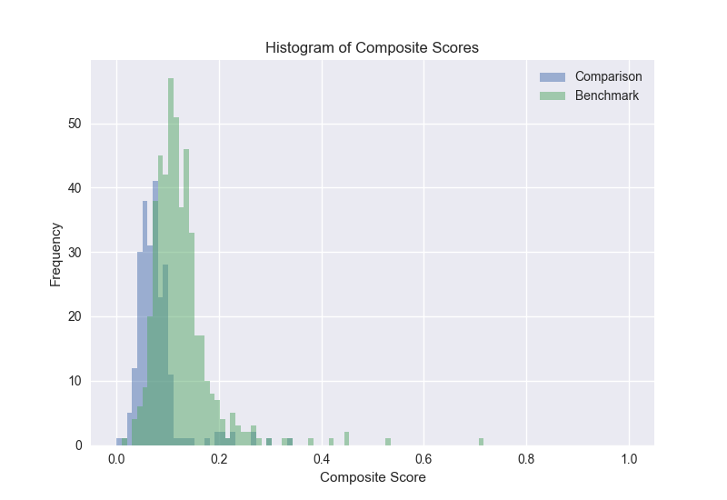

# Xena Patent Analytics

## Overview

Xena is a simple python script that accepts as input two CSV lists of patents that include, for each patent, at least the following basic data:

* Patent number
* Priority date
* Expiration date
* Number of forward citations (i.e., number of times the patent has been cited by other patents
* Number of words in the first independent claim

The script then calculates, for each patent, a composite score equal to a weighted sum of three normalized components:

1. "Impact" meaning number of forward citations divided by the number of days since the priority date to present
2. "Scope" meaning the inverse of the number of words in the first independent claim
3. "Longevity" meaning number of days to expiration

By normalizing and combining these factors, the relative quality of each patent in each list can be estimated numerically. Choosing weights for each normalized factor that together sum to one, we compute a composite score from zero to one with zero being the worst possible patent and 1 being the best.

Using these composite scores, the script produces a comparison and visualization of the relative quality of the two lists of patents. Composite scores are calculated for the first list ("benchmark.csv") — a benchmark set of familiar patents. Percentiles are then assigned to each patent in the first (benchmark) list based on relative composite score within the first list. Next, composite scores are calculated for the the second list ("comparison.csv") — an arbitrary set of unfamiliar patents. Finally, percentiles from the first list are interpolated for patents in the second list using the composite score calculation. A visualization of the relative quality of the benchmark and comparison portfolios is plotted ("xena.png").

]

Last, but not least, using a coefficient of dollars per composite score, a price is assigned to each patent in the comparison list. The resulting "xena.csv" output file provides an estimated price based on the comparable patents used to calculate the coefficient and their sale price. For purposes of demonstration, the coefficient has been set to $1,000,000 (i.e., a patent with a perfect composite score would be equal to $1,000,000). But the coefficient can also be calculated using the benchmark set or any other set of patents sold for which composite scores have been calculated and the sale price is known.

## Prerequisites

Xena was developed and runs in a virtual environment on Python 3.10.4.

Xena was designed to run on a Mac, with all input and output files located in the ~/Downloads directory. The script can be modified to run on other platforms and with different input and output directories by editing the "benchmark", "comparison", "home", "results", and "not_scored" variables declared at the beginning of the script.

## Usage

You can run Xena as follows:

* Ensure that you have Python 3.10.4 installed (the script has not been tested on earlier versions of Python)
* (Optional, but recommended) Activate a virtual environment (e.g., `python -m venv xenv` and `source xenv/bin/activate`)
* Install the required packages (e.g., `pip install -r requirements.txt`)
* Ensure that the input files ("benchmark.csv" and "comparison.csv") are located in the ~/Downloads directory
* Run the script (e.g., `python xena.py`)

## Output

By default, output files are written to the ~/Downloads directory. The output files include:

* Percentile.png — a histogram of the comparison portfolios by percentile score within the *benchmark* portfolio
* Days to Expiration.png — a histogram of the number of Days to Expiration for each patent in the comparison portfolio
* Scope.png — a histogram of the inverse to the number of words in the first independent claim for each patent in the comparison portfolio
* Normalized Impact.png — a histogram of the normalized impact score for each patent in the comparison portfolio
* xena.png — a visualization of the relative quality of the benchmark and comparison portfolios using composite score as a common metric
* not_scored.csv — a list of patents in both portfolios that could not be scored due to invalid data (in this case, zero for first claim word count) or expiration
* xena.csv — the list of patents from the comparison portfolio with a composite score and estimated price based on the benchmark portfolio and coefficient

## License

MIT